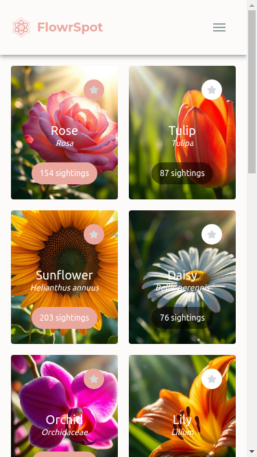
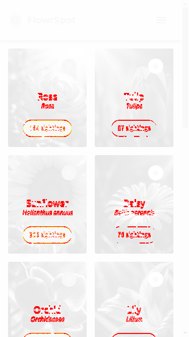

# React Cypress Screenshot Fun
Simple React App to test out Redux RTK Query and MUI. It also serves as showroom for custom Cypress plugin which makes comparison of screenshots in e2e tests easy. 

Stack used: React | React-router | Redux Toolkit with RTK Query | Material UI | Cypress | Mock service Worker

## Getting started (run app in docker)
To enable API mocking set `.env` file to:
```
VITE_API_URL=https://mock-my-api.com/
VITE_ENABLE_API_MOCKING=enabled
```

Then run:
```
make docker/e2e
```

This comand will run app in dev mode and run e2e screenshots. As there are no changes in codebase everything should pass.

If you want to have some fun go ahead and change something in codebase. 
(You can also change line  `63` in`/src/components/Bird/BirdCard/BirdCard.tsx` to `paddingBottom: '22px'`,  as in example below)

Now run e2e test again and they should fail.

Checkout `/e2e/cypress/screenshoots` folder for more info.


## How does it work?
Plugin compares reference image with actual image recorded during e2e test:

 


If images are the same test passes. If there is a difference test fails and diff image is created:




## How to generate reference screenshoots?
In case that you are adding new e2e tests, new screenshots have to be generated.

To generate new reference screenshots run:

``` 
make docker/e2e/generate
```

Thats is, congatulations! You have sucessfully created new screenshots!

From now on screenshots that have been just generetaed are the golden standardad for every next e2e run.


## Other 
Check Makefile for more useful commands.

